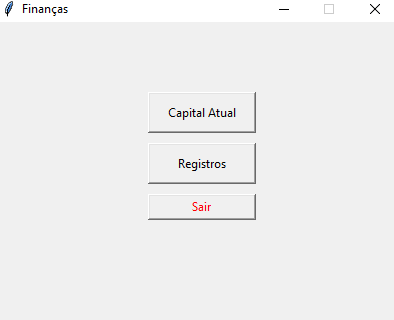
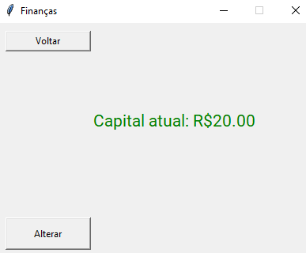
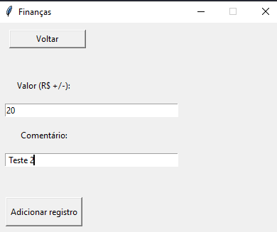
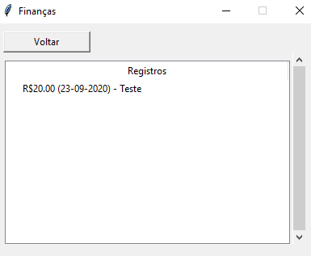

# Finanças
## Aplicação simples para o controle de finanças com Python

#### 🚧 Refatoramento de código em andamento 🚧

### Features
- [x] Visualização e alteração do capital registrado.
- [x] Visualização de registros de alterações passadas ao capital.
- [ ] Possibilidade de apagar/alterar registros pelo programa.

### Como utilizar
```bash
# Clone este repositório em sua máquina.
$ git clone <https://github/fpeduu/financas-python>

# Acesse a pasta do projeto no terminal/cmd.
$ cd financas-exe

# Execute o programa
$ financas.exe
```

### Screenshots

##### Página inicial


##### Visualização de capital


##### Alteração de capital


##### Visualização de registros de alterações


### Tecnologias
- [Python](https://www.python.org/)
- [Tkinter](https://docs.python.org/3/library/tkinter.html)
- [Auto-py-to-exe](https://nitratine.net/blog/post/auto-py-to-exe/)